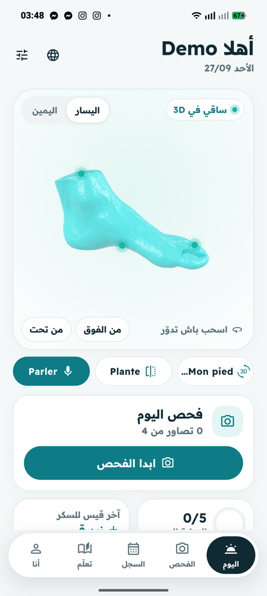
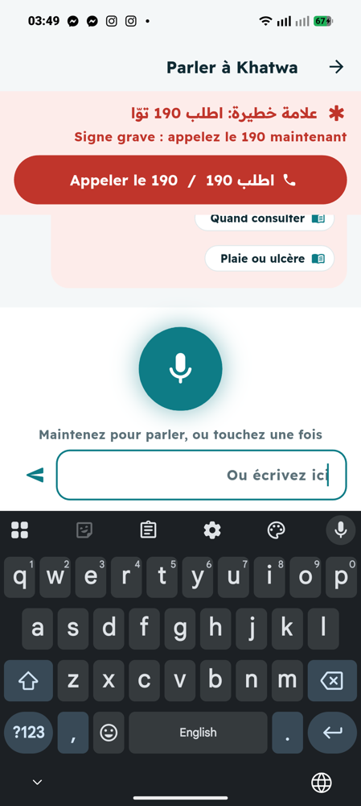
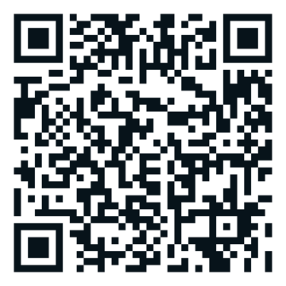
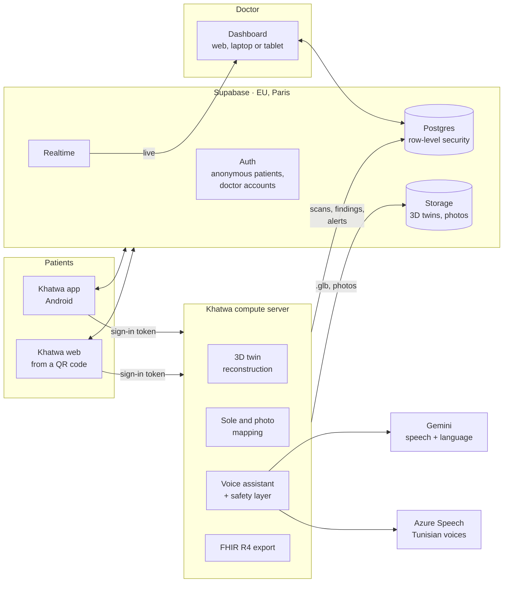
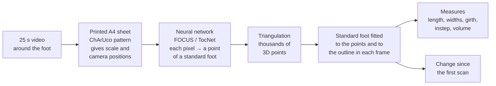
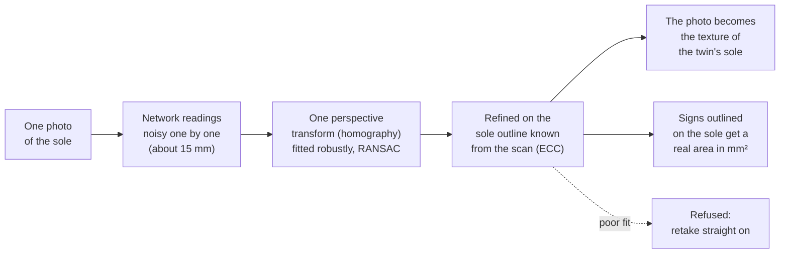
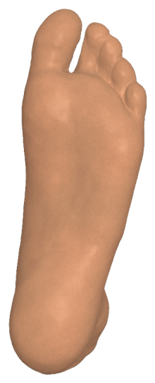
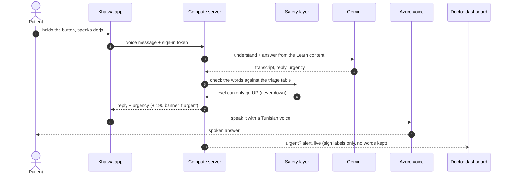
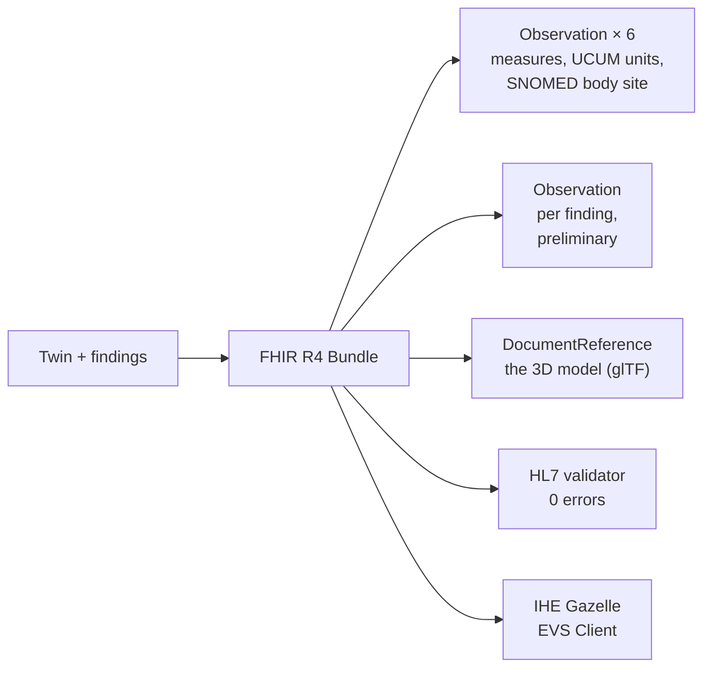

<div align="center">

# Khatwa · خطوة

### Le pied diabétique, suivi en 3D. Une voix qui parle tunisien. Un médecin qui voit tout, en direct.

*A 3D digital twin of the diabetic foot, a voice assistant that speaks Tunisian derja, and a live doctor dashboard, on open standards.*

[](https://khatwa-demo.netlify.app/?demo)
[](https://flutter.dev)
[](#interoperability-fhir-r4-and-gazelle)
[-3ECF8E?style=for-the-badge&logo=supabase&logoColor=white)](https://supabase.com)
[](#the-voice-assistant)

**Future Health Connectathon 2026 · Défi 3.1** · *Repérer plus tôt les signes d'alerte du pied diabétique*
**Telehealth Connect 2026, Tunis**

<br/>


&nbsp;&nbsp;

&nbsp;&nbsp;


<sub>Home on the patient's 3D foot · an urgent sign told to the assistant · scan to try it (no install)</sub>

</div>

---

## Why

When you live with diabetes, the foot loses feeling and heals badly. A crack, a callus or a small blister can turn into an ulcer, an infection, an amputation. It is caught early only if someone **looks at the foot every day**, including **the sole**, where most ulcers start and where most people cannot see.

In one Tunisian study (Mahdia, 220 patients), about **27 %** were already at risk of a foot ulcer.

Khatwa makes that daily look easy, turns it into a **3D record that follows the foot over time**, answers questions **in the language people actually speak at home**, and puts **the doctor in the loop, live**.

---

## What it does

<table>
<tr>
<td width="50%" valign="top">

### For the patient
- **3D digital twin** of their own foot from a 25 s phone video around it, next to a printed A4 sheet
- **The sole on the 3D foot**: one photo of the sole is placed on the twin (2 to 3 mm on straight-on photos in our tests), so a callus under the ball of the foot stays at the same spot, visit after visit
- **Mark a sign** on any photo (callus, blister, wound, colour change, or "I don't know"), and get the advice of one triage table: *go now, call 190* / *see someone within 24 h* / *keep checking daily*
- **Talk to Khatwa**: hold the button and ask, in **Tunisian derja**, Arabic, French or English; answers are spoken with a **Tunisian voice**
- **Daily foot check**, risk profile (IWGDF 0 to 3), glucose log, 26 learning articles
- **"Envoyer au médecin"**: twin, sole, signs and a FHIR bundle, in one tap

</td>
<td width="50%" valign="top">

### For the doctor
- **Live triage board**: urgent first, new alerts arrive in a second (a black toe told to the assistant, a wound placed on the sole)
- **Each patient's 3D foot** with the signs pinned where they are, left/right, a visit timeline, measurement trends
- **Sole photos** side by side over time
- Reply to the patient, set the next visit, mark a sign reviewed or healed
- **Export FHIR R4**, validated with the official HL7 validator (0 errors)
- **Public health view** for decision makers: lesions of every patient on one 3D foot, risk levels, alerts per week, by governorate

</td>
</tr>
</table>

> **The rule that never breaks: Khatwa never diagnoses.** It helps notice, sort and send. A health professional decides. Urgent signs always lead to **190**, and nothing ever tells a patient their foot is "fine".

---

## How it fits together



- The apps talk to Supabase directly for their own data. Row-level security means a patient sees only their own record, and a doctor account sees the patients.
- Heavy work (3D, photo mapping, the voice assistant) runs on the compute server, which checks the patient's Supabase sign-in and writes the results back to Supabase, where the doctor sees them live.
- Patients are **pseudonymous** (a random reference like `k-7f3a9c2b1d`, a pseudonym like "Patient 07"). No name or phone number from the phone ever reaches the server.

---

## The 3D digital twin



Every twin shares the **same mesh**: point number 5 000 is the same anatomical spot on every foot, at every visit. That is what lets Khatwa compare visits and keep a sign in its place.

### The sole, which a standing scan cannot see





Home photos of the sole are an accepted way to catch early warning signs ([Foot Selfie, Armstrong's team, 2023](https://journals.sagepub.com/doi/10.1177/19322968211053348); [remote monitoring, 2025](https://onlinelibrary.wiley.com/doi/full/10.1002/dmrr.70096)). Photos alone are not a diagnosis ([van Netten 2017](https://www.ncbi.nlm.nih.gov/pmc/articles/PMC5573347/)), which is why Khatwa sends them to a clinician. What Khatwa adds is **the place**: the photo lives on the patient's own 3D sole.

<br clear="right"/>

---

## The voice assistant



- **Deterministic safety layer**: a black toe, pus, fever with a foot problem, a spreading redness… always reach *go now, 190*, whatever the AI says. Clothing colours ("black socks") and general questions ("what are the signs of…?") do not raise false alarms. Tested with 170+ cases in derja, arabizi, French and English.
- **No AI? Still works**: without a network key, answers come from the 26 reviewed Learn articles, with the same safety layer.
- **Privacy**: no audio and no text of the conversation are stored. The doctor's alert carries only the sign labels.

---

## What we measured, honestly

| What | Result | How |
|---|---|---|
| 3D surface | **1.1 to 1.5 mm** error | synthetic scans, known ground truth |
| Foot length | **0.85 mm** mean error | synthetic scans |
| False change alarms | **0 of 10** no-change pairs | 5 repeat scans through the real pipeline |
| Swelling detection | **8 mm** detected, 4 mm below the noise | same benchmark |
| Sole photo placement | **2 to 2.6 mm** median (straight on) | rendered sole photos, 10 camera set-ups |
| Voice safety layer | **170+** test phrases pass | derja, arabizi, FR, EN, negations, doubt |
| FHIR bundle | **0 errors** | official HL7 validator, R4 4.0.1 |
| End to end | all checks pass | video → twin → change → photo → finding → voice → FHIR → erase |

**Limits we say out loud:** measurements are validated on simulated scans only (real test-retest comes next), so they are shown as *research, provisional thresholds*; the sole is photographed, not measured in 3D; the triage table and the 26 articles await sign-off by the team's clinician; demo data only.

---

## Interoperability: FHIR R4 and Gazelle



Left and right feet are coded with SNOMED CT (22335008, 7769000), units with UCUM, measurements are `preliminary` (research), findings reported by the patient are never `final`. One bundle per patient, served as `application/fhir+json`.

---

## Privacy and security

- Patients are pseudonymous; the audience's guest accounts hold no real data and are wiped after the event
- Row-level security in Postgres: a patient reads only their own rows; doctor accounts read patients
- The compute server checks every Supabase sign-in, and refuses another patient's record (tested)
- Photos are re-encoded without EXIF (no GPS, no phone model); uploads have size limits
- Server data encrypted at rest (AES-256-GCM); an erasure cannot be undone by a scan still processing
- Sign-up confirms the e-mail with a 6-digit code (Supabase Auth); sign-in asks for the code too, except on a device where "Rester connecté" was ticked in the last 30 days
- On the phone: local accounts, hashed passwords, and everything stored is encrypted with a key sealed by a key derived from the password (older PIN accounts move over at their next sign-in)
- Automatic sign out after 10 minutes without activity, unless "Rester connecté" was ticked on that device
- "Continuer en invité": a guest account with no data typed, which can become a real account later

---

## Run it

```bash
flutter pub get
flutter run                 # Android phone
flutter run -d chrome       # web
flutter build web --release # the QR demo site
```

| Link | Opens |
|---|---|
| `https://khatwa-demo.netlify.app/?demo` | the intro, then the profile choice ("Continuer en invité" in one tap) |
| `https://khatwa-demo.netlify.app/?medecin` | the doctor dashboard, live after the demo doctor signs in |

The compute server (3D, sole mapping, voice, FHIR) is a Python/FastAPI service kept in a separate repository with its own tests and benchmarks. The app finds it through Supabase (`app_config.server_url`), so its address can change without a new build.

<details>
<summary><b>Project structure</b></summary>

```
lib/
  data/          accounts, encryption, cases, rules, AI gateway, FHIR,
                 cloud.dart (Supabase), khatwa_server.dart (compute server)
  features/
    twin/        scan, 3D twin, sole photo, sign photo, 3D viewer
    voice/       the voice-first assistant
  doctor/        dashboard v2: triage board, patient view, public health,
                 demo and Supabase repositories
  screens/       home tabs, daily check, learn, settings, sign-in
  ui/            design system, 3D foot stage, tap maps, strings (4 languages)
assets/models/   the model foot (glTF) and its zones
supabase/        the data model and access rules
docs/            design notes and task briefs
```
</details>

---

<div align="center">

**Khatwa** · خطوة · *a step*

Prototype for research. Not a medical device. In an emergency, call **190**.

</div>
